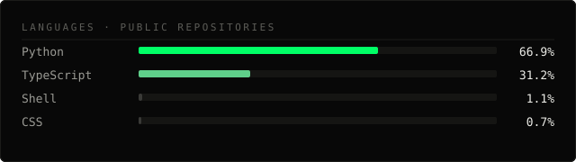
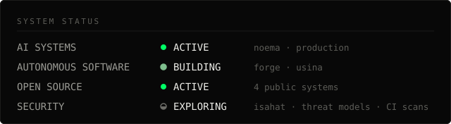

**AI engineer. Autonomous systems builder.**
I build software that keeps working after I close the laptop: learning systems that model what you know, acquisition engines with spending limits written in code, radars that measure attention instead of guessing it, and the security tooling to audit all of it. Self-taught. Based in Santos, Brazil. Shipping in public at [aislam.dev](https://aislam.dev).


## now

- **noema** — hardening the public web app for production: SEO, legal pages, error paths, analytics. `sep 2026`
- **forge** — foundation landed: capital guard, decision ledger and sentinel, all tested. Next: connectors, persistence. `sep 2026`
- **isla** — v2 engine: regional lead detection, provenance for every number, live SSE control room. `aug 2026`
- **usina** — private creative-intelligence platform. isla was extracted from it; forge plugs into its traffic layer.


## systems

**[noema](https://github.com/aislamsilvalol-ctrl/noema)** · adaptive learning platform
Turns documents, notes and questions into a model of what you understand and what you are about to forget. Hybrid retrieval over pgvector, grounded answers with refusal when the material does not support them, a mastery engine, FSRS scheduling, multi-provider AI gateway with encrypted bring-your-own-keys.
`Python · FastAPI · Next.js · PostgreSQL + pgvector · Redis · Dramatiq · Anthropic / OpenAI / Ollama`
status: active · v0.1 · AGPL-3.0

**[forge](https://github.com/aislamsilvalol-ctrl/forge)** · adaptive acquisition infrastructure
An autonomous advertising engine where the capital limits live in code, not in a prompt. Every model proposal is schema-validated and passes a deterministic sentinel before it can move money. Implemented and tested so far: capital guard, decision ledger, sentinel. Connectors, persistence and web surfaces are on the roadmap, and the README says so.
`TypeScript · pnpm workspaces · vitest`
status: v0.1 foundation · Apache-2.0

**[isla](https://github.com/aislamsilvalol-ctrl/isla)** · virality radar
Watches public sources (Google Trends, Wikipedia, Bluesky, Hacker News, RSS, YouTube, Twitch, Reddit) and answers what is about to go viral. Velocity is measured between real samples; without two samples it says "collecting baseline" instead of inventing a number. REST + SSE API, live web UI, optional LLM clustering.
`Python · FastAPI · SQLite · SSE · Anthropic (optional)`
status: v0.2 · self-hostable · MIT

**[isahat](https://github.com/aislamsilvalol-ctrl/isahat)** · AI security auditor for vibe-coded apps
Safe-by-default web and API auditing engine: headers, cookies, CORS, open redirects, reflected XSS, SQL injection, path traversal, API surface discovery. One engine shared by a CLI, a local bridge API and a desktop app. Reports in JSON, Markdown, HTML, SARIF and CSV. Ships with a threat model and a responsible-use policy.
`Python · Typer · FastAPI · SQLite · TypeScript desktop shell`
status: alpha · v0.1 · Apache-2.0


## stack

Only what the repositories above actually use.

```
languages   Python · TypeScript · JavaScript · Shell
ai          Anthropic API · OpenAI API · Ollama · RAG on pgvector · FSRS
backend     FastAPI · Node.js · SQLAlchemy · Dramatiq workers
web         Next.js · React · Tailwind · Three.js / GSAP (aislam.dev)
data        PostgreSQL + pgvector · Redis · SQLite
infra       Docker · GitHub Actions · Vercel
security    gitleaks · pip-audit · CycloneDX SBOM · SARIF output
```




## system / security



Security here is a practice, not a title. What that looks like in the code:

- **threat models before features** — forge and isahat document what they protect and what they assume hostile, including model output and campaign text as untrusted input.
- **secrets never touch the log** — noema redacts provider and Stripe key shapes at the logger, with tests that prove it.
- **CI that scans** — gitleaks on noema and isahat, pip-audit and a CycloneDX SBOM on isahat, pinned Python dependencies on noema so a green build stays green.
- **private disclosure** — `SECURITY.md` on noema, forge and isahat points to GitHub private vulnerability reporting; isla's is in [review](https://github.com/aislamsilvalol-ctrl/isla/pull/1).

## open source

Built to be run by strangers. Each system ships with a quick start, an architecture document, a license and a security policy. If a README overstates what the code does, that is a bug and I fix the README.

## contact

`aislam.dev` → [aislam.dev](https://aislam.dev)
`linkedin` → [aislam-camarini-mastro](https://www.linkedin.com/in/aislam-camarini-mastro)
`security` → private vulnerability reporting on each repository

<!--
  You opened the source. That is where the actual profile lives:
  https://github.com/aislamsilvalol-ctrl?tab=repositories
  Green is reserved for signal. Everything else is the work.
-->
